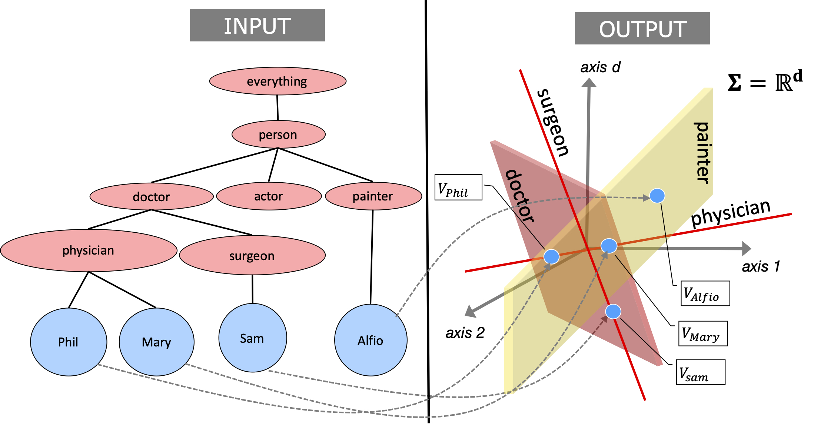

# Inductive-Quantum-Embedding

## Introduction
This repository contains source code necessary to reproduce the results presented in the paper [Inductive Quantum Embedding].
Quantum logic inspired embedding (aka Quantum Embedding (QE)) of a Knowledge-Base (KB) was proposed in our previous work [Quantum embedding of knowledge for reasoning](https://papers.nips.cc/paper/8797-quantum-embedding-of-knowledge-for-reasoning). QE preserves the logical structure of the input KB given in the form of unary and binary predicates hierarchy. Such structure preservation allows one to perform Boolean logic style deductive reasoning directly over these embedding vectors. The original QE idea, however, is limited to the transductive (not inductive) setting. Moreover, the original QE scheme runs quite slow on real applications involving millions of entities. This paper alleviates both of these key limitations. As an application, we show that one can achieve state-of-the-art performance on the well-known NLP task of fine-grained entity type classification by using the inductive QE approach. 

 

## Instructions for reproducing the numbers given in the paper

Following are the steps to reproduce the results reported in the paper.

1. Clone this repository on your local machine.

2. Download **checkpoint** (https://ibm.box.com/s/n0wo58b3dsb7t5jub5bbwuj38bdl5d58) inside the folder **checkpoints**. This checkpoint is our **Context Vectors into Quantum Embedding Model** trained on our our 90% split of the training data (as mentioned in the paper).

3. Pre-processed features are provided inside the **feature_vectors_and_class_labels** folder.

4. We have provided the split of test data inside **data_preprocessed** folder to reproduce the results reported in the paper. We used 10% of the Test set as development set to tune parameters of our **Context Vectors into Quantum Embedding Model** and rest 90% for the final evaluation. Finally, run **inference.py** provided inside folder **context_to_quantum_embeddings** on **test_90_data_processed.json** file provided inside the folder **data_preprocessed** with above downloaded checkpoint (Exact command is given in the readme file inside folder **context_to_quantum_embeddings**) to reproduce the results.


## Instructions to retrain the models and generate the numbers from scratch at your own
To retrain the models and generate the numbers from scratch, please follow these steps:

1. Clone this repository on your local machine.

2. Download *fine-grained entity type classification* over **Wiki** ([Ling & Weld, 2012](http://xiaoling.github.io/pubs/ling-aaai12.pdf)) dataset inside folder **data_preprocessed**. ([download JSON](https://drive.google.com/file/d/0B2ke42d0kYFfVC1fazdKYnVhYWs/view?usp=sharing))
  - In our reported experiments, we had divided the training data into a split of 90:10. The 10% data was used to find best hyperparameters of the quantum embeddings.     

3. Download glove word embeddings inside the folder **glove_embedding**, by firing the following commands while being inside the directory **glove_embedding**:

    `wget http://nlp.stanford.edu/data/glove.840B.300d.zip`

    `unzip glove.840B.300d.zip`

    `rm glove.840B.300d.zip`


4. Create feature vectors from input data to generate quantum embeddings. The code and the instructions for this are given in the folder **generate_feature_vectors_and_class_labels**.

5. Generate quantum embeddings from the fetures generated above. The code and the instructions for this are given in the folder **generate_quantum_embeddings**.

6. Learn a function between left-right context vectors of a training entity in a sentence and its corresponding quantum embedding (achieved in the previous step). The code and the instructions for this are given in the folder **context_to_quantum_embeddings**. 

7. Finally, you need to run **inference.py** provided inside folder **context_to_quantum_embeddings** on your test data using the trained model obtained above. (Exact command is given in the readme file inside folder **context_to_quantum_embeddings**).

## Citations
Please consider citing this paper if you use the code:
```
@inproceedings{srivastava2020quantum,
  title={Inductive Quantum Embedding},
  author={Srivastava, Santosh K and Khandelwal, Dinesh and Madan, Dhiraj and Garg, Dinesh and Karanam, Hima and Subramaniam, L Venkata},
  booktitle={Advances in Neural Information Processing Systems},
  year={2020}
}

```
