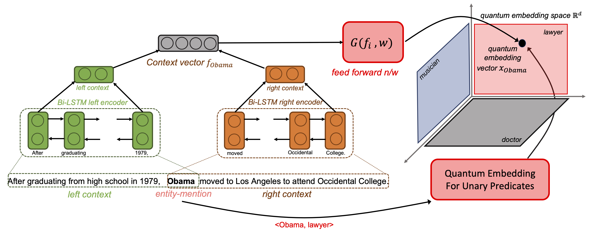

# Code for Transforming Context Vectors into Quantum Embedding for FgETC (Fine-Grained Entity Type Classification) task #

 

**To train the model to Transforming Context Vectors into Quantum Embedding, run the following command:**

`python context_encoder_train.py -features_dir_path ../feature_vectors_and_class_labels/ -entity_embd_path ../quantum_embds/entities_embd.pkl -concept_embd_path ../quantum_embds/concepts_embd.pkl`

**To perform inference and reproduce the results in the paper, run the following command:**

`python inference.py -checkpoint_path ../checkpoints/best_checkpoint.pt -test_data_path ../data_preprocessed/test_90_data_processed.json -concept_embd_path ../quantum_embds/concepts_embd.pkl -features_dir_path ../feature_vectors_and_class_labels -threshold_level_wise 0.15 -constant_to_divide 5`
